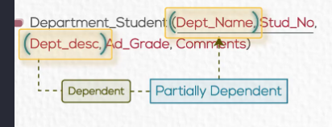

# Normalization 

---

## What is Normalization 
`. The process of decomposing unsatisfactory "bad" relations by
breaking up their attributes into smaller relations.`

## Stpes of common Normalization

### [First Normal Form](#1nf-first-normal-form--)
### [Second Normal Form](#2nf-second-normal-form--)
### [Third Normal Form](#3nf-third-normal-form--) 
---

### 1NF (First Normal Form ) : 

**In This Form** Table mustn't have 
- Multivaled Attribute ---> Seperate it in New table with primary key 
- Repeating Group  ---> Sperate it in new table with primary key 
- Composite Attribute --> broken it in his value and put his value in the same table 

### 2NF (Second Normal Form ) : 

**In This Form** Table : 
- must be in 1NF 
- Mustn't contain any [Partial Dependency ](#what-is-partial-dependency) ---> Sepearte it in new table with primary key 

### 3NF (Third Normal Form ) : 

**In This Form** Table : 
- must be in 2NF 
- Mustn't contain any [Transitive Dependency](#what-is-transitive-dependency) ---> seperate it in new table and make non-key attribute that another depend on a primary key 

#### What is Partial Dependency 

**`is Occure when non-key attribute depend on parital of key attribute`**
when you have a composite key and there is non-key depend on one of them not both 

#### What is Transitive Dependency 

**`is Occure when non-key attribute depend on non-key attribute that key depend on key attribute`**

